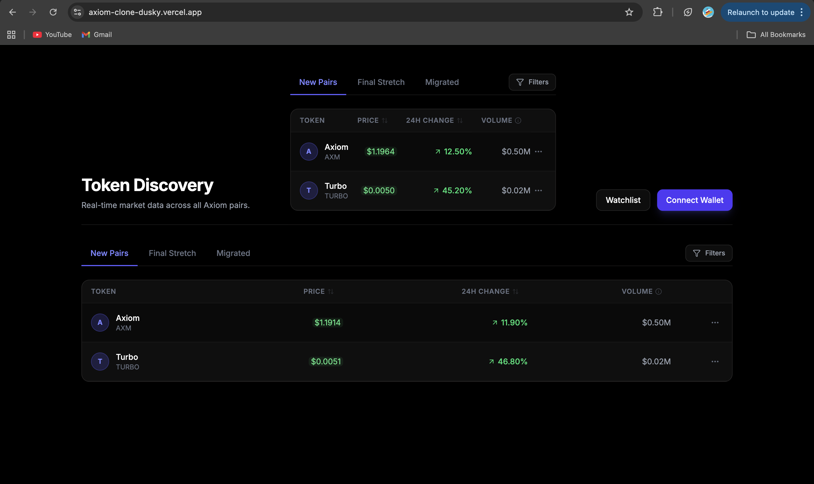
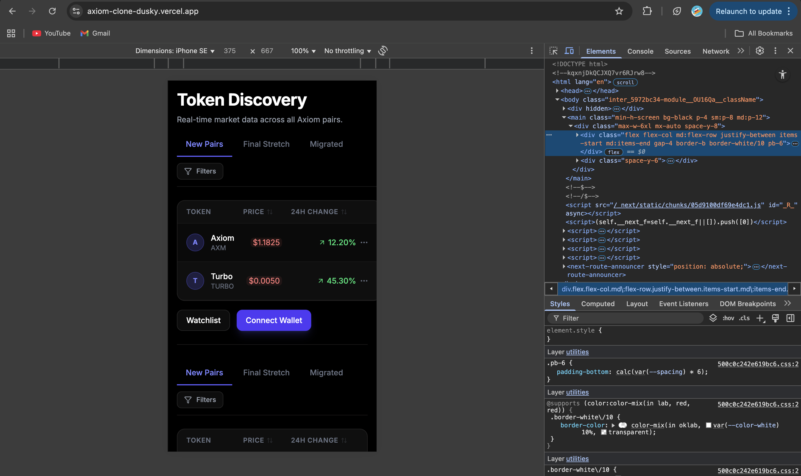

# Axiom Trade Clone

A pixel-perfect replica of the Axiom Trade token discovery table, built with Next.js 14, Redux Toolkit, and React Query.

##  Live Demo
[View Live Deployment](https://axiom-clone-dusky.vercel.app)

## Video Walkthrough
[Watch on YouTube](https://youtu.be/k5Y9Q4e6QdQ)

##  Features Implemented
- **Tabs:** New Pairs, Final Stretch, Migrated.
- **Real-time:** Mock WebSocket updates with green/red flash effects.
- **Sorting:** Redux-powered sorting by Price, Change, etc.
- **Interactive:** Trade Modal (Dialog) and Filters (Popover).
- **Performance:** Memoized components and Skeleton loading states.

##  Responsive Design Snapshots

### Desktop View

### Mobile View (320px)

## Tech Stack
- Next.js 14 (App Router)
- TypeScript (Strict)
- Tailwind CSS
- Redux Toolkit
- React Query
- Shadcn UI (Radix)